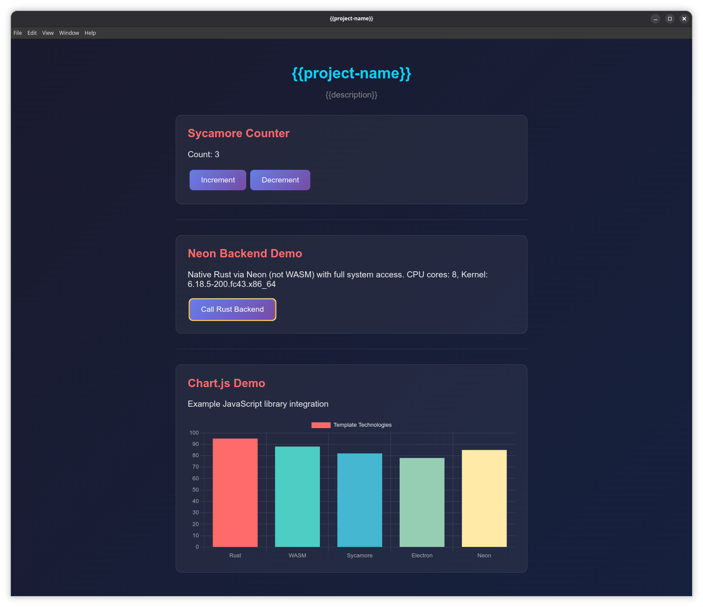

# Rust + Electron + Sycamore + Neon Template




A full Rust stack template for building desktop applications with Electron.

- **Frontend**: [Sycamore](https://sycamore-rs.netlify.app/) reactive UI framework written in Rust, compiled to WASM
- **Backend**: [Neon](https://neon-rs.dev/) for native Node.js bindings (file I/O, system APIs, etc.) written in Rust
- **Shell**: Electron with IPC bridge between WASM frontend and Neon backend

## Features

- Use [cargo-generate](https://github.com/cargo-generate/cargo-generate) to create a new project from this template. Instructions below.
- Rust in frontend ([Sycamore](https://sycamore-rs.netlify.app/)) **and** Rust in the backend ([Neon](https://neon-rs.dev/))
- [DaisyUI](https://daisyui.com/) component framework already integrated — CSS only, no JavaScript runtime
- Typical application GUI layout with header, footer, resizable sidebars, and main content area
- Demo code showing shared application state between different UI components using Sycamore's context system
- Demo code showing how to call Rust backend functions from the frontend via IPC
- Demo code showing persistent app configuration stored in a JSON file, loaded at runtime. Uses the [directories](https://crates.io/crates/directories) crate to find the appropriate config directory for each OS (`~/.config/`, `~/Library/Application Support/`, `%APPDATA%`). The config directory uses the project name you choose during cargo-generate.
- Demo example integration of external JavaScript libraries (Chart.js) with Sycamore/WASM
- Standard Electron procedures for bundling
- Already written asset bundling code using [Trunk](https://trunkrs.dev/) for WASM compilation and automatic asset bundling
- [just](https://github.com/casey/just) command runner with pre-configured build, dev, and maintenance commands

## Overview

This is a template for [cargo-generate](https://github.com/cargo-generate/cargo-generate). It scaffolds a complete Rust + Electron application with:

```
┌─────────────────────────────────────────────┐
│            Electron App                     │
│  ┌───────────────────────────────────────┐  │
│  │  Main Process (Node.js + Neon)        │  │
│  │  - Native Rust backend via Neon       │  │
│  └───────────────────────────────────────┘  │
│                    │ IPC                    │
│  ┌───────────────────────────────────────┐  │
│  │  Renderer Process (Chromium + WASM)   │  │
│  │  - Sycamore reactive UI               │  │
│  └───────────────────────────────────────┘  │
└─────────────────────────────────────────────┘
```

### Create your New Project using cargo-generate

```bash
# Install cargo-generate (once)
cargo install cargo-generate
or
cargo binstall cargo-generate (faster)

# Generate from this template
cargo generate --git https://github.com/youruser/rust-electron-sycamore-template
```

You'll be prompted for:
- **Project name** (kebab-case, e.g., `my-app`)
- **Description**
- **Author**

### Now what?

Look at the `justfile` commands to build and run the app.
Read more in this README to understand how the pieces fit together.
You need to install the [`just`](https://just.systems) command runner first.

### What is Neon?

Neon is a framework for writing native Node.js modules in Rust.
It allows you to create high-performance backend code that can be called from JavaScript running in the Electron main process.
The important point is that this Rust code is fully native.
It runs on the host OS.
This template provides demo code showing how to call Neon functions from the frontend via IPC.

### What is Sycamore?

Sycamore is a reactive UI framework for building web applications in Rust.
It compiles to WebAssembly (WASM) and runs in the browser environment.
In this template, Sycamore is used to build the frontend UI of the Electron application.
The Sycamore code is compiled to WASM using Trunk and loaded in the Electron renderer process.
We can communicate between the Sycamore frontend and the Neon backend using Electron's IPC mechanism.
Demo code is provided to show this.

## Justfile Commands

This project uses [just](https://github.com/casey/just) as a command runner.

### Getting Started

You will need to have the following installed:
- [Node.js](https://nodejs.org/) (v16+)
- [Rust](https://www.rust-lang.org/) (stable)
- [trunk](https://trunkrs.dev/) (for building WASM)
- [just](https://github.com/casey/just) (command runner)

Then, run:

```bash
just setup    # Install deps, build everything, and run
```

### Licensing

This **template repo** is licensed under the [MIT License](LICENSE). The repo
that you generate from this template will **not** contain this license file.
During the cargo-generate process, you will be prompted to choose your own
licence, which will be added to the workspace `Cargo.toml`. However, you still
need to add the appropriate LICENCE file to your code. This is not done
automatically by cargo-generate.

### Development

```bash
just dev      # Run with DevTools open
just watch    # Watch frontend for changes (run in separate terminal)
```

### Building

```bash
just build          # Build everything (release)
just build-wasm     # Build only WASM frontend
just build-backend  # Build only Neon backend
```

### Maintenance

```bash
just check    # Cargo check workspace
just fmt      # Format Rust code
just lint     # Run clippy
just clean    # Remove all build artifacts
```

Run `just` with no arguments to see all available commands.

## Integrating External JavaScript Libraries

This template includes a Chart.js integration example demonstrating how to incorporate external JavaScript libraries into your Sycamore/WASM application. The pattern described here applies to any JavaScript library you want to use.

### Prefer Local Assets Over CDNs

For Electron desktop applications, **always prefer bundling JavaScript libraries locally** rather than loading them from CDNs. Reasons include:

- **Offline support**: Desktop apps should work without an internet connection
- **Predictable behavior**: No risk of CDN outages or version changes breaking your app
- **Security**: Reduced attack surface from third-party hosted scripts
- **Performance**: No network latency on startup

Only use CDN-loaded assets if you have a specific requirement for it (e.g., loading user-specified external resources).

### How to Add a JavaScript Library

This template includes an example of integrating Chart.js. To add your own library, follow these steps:

#### 1. Install via npm

```bash
npm install <library-name> --save
```

This downloads the library to `node_modules/` and records the dependency in `package.json`.

#### 2. Copy to Frontend Assets

Copy the library's distributable file (usually a UMD or IIFE build) to the frontend assets:

```bash
mkdir -p crates/frontend/assets
cp node_modules/<library-name>/dist/<library>.min.js crates/frontend/assets/
```

Look for `.umd.js`, `.umd.min.js`, or `.min.js` files in the library's `dist/` folder. These are browser-ready builds that don't require a module bundler.

#### 3. Configure Trunk to Bundle the Asset

In `crates/frontend/index.html`, add a trunk directive to copy the file and a script tag to load it:

```html
<link data-trunk rel="copy-file" href="assets/<library>.min.js" />
<script src="<library>.min.js"></script>
```

When trunk builds the frontend, it copies the asset to the output directory (`electron/renderer/`).

#### 4. Create a JavaScript Helper Function

Add a helper function in `index.html` that your Rust code can call:

```html
<script>
  window.myLibraryHelper = function(arg1, arg2) {
    // Use the library here
    return SomeLibrary.doSomething(arg1, arg2);
  };
</script>
```

This pattern keeps library-specific JavaScript isolated and provides a clean interface for Rust.

#### 5. Call from Rust via wasm_bindgen

In your Rust code, declare the external function and call it:

```rust
use wasm_bindgen::prelude::*;

#[wasm_bindgen]
extern "C" {
    #[wasm_bindgen(js_namespace = window, js_name = myLibraryHelper)]
    fn my_library_helper(arg1: &str, arg2: i32);
}

// Then call it from your component
my_library_helper("hello", 42);
```

For functions that need to run after the DOM is ready, use Sycamore's `on_mount`:

```rust
use sycamore::web::on_mount;

#[component]
fn MyComponent() -> View {
    on_mount(|| {
        my_library_helper("hello", 42);
    });

    view! { /* ... */ }
}
```

### How Assets End Up in the Final Bundle

The build pipeline works as follows:

1. `npm run build:wasm` runs trunk in `crates/frontend/`
2. Trunk compiles Rust to WASM and processes `index.html`
3. Assets marked with `data-trunk rel="copy-file"` are copied to `electron/renderer/`
4. Electron loads `electron/renderer/index.html` which references the local assets
5. When packaging the app, everything in `electron/` is bundled into the final executable

### Example: Chart.js Integration

This template includes a working Chart.js example. The relevant files are:

- `crates/frontend/assets/chart.umd.min.js` - Local Chart.js library
- `crates/frontend/index.html` - Trunk copy directive, script tag, and `initDemoChart` helper
- `crates/frontend/src/lib.rs` - `ChartDemo` component with `wasm_bindgen` extern declaration
- `crates/frontend/input.css` - Chart container styling

To remove this example from your project, delete the `ChartDemo` component and its usage in `App`, remove the Chart.js script/helper from `index.html`, delete the assets file, and remove the chart styles from CSS.

## Styling with DaisyUI

This template uses [DaisyUI](https://daisyui.com/), a component library built on Tailwind CSS.
It provides pre-built UI components (buttons, cards, alerts, etc.) that work with Tailwind's utility classes.
You are not forced to use DaisyUI and it can be removed easily if required.
However, it is not so easy to find a comparable UI component library that is CSS-only.

### How It Works

Tailwind CSS and DaisyUI are installed as npm dev dependencies. Trunk hooks compile the CSS during build:

- `input.css` imports Tailwind and the DaisyUI plugin
- Trunk's `[[hooks]]` in `Trunk.toml` run `tailwindcss` to compile `input.css` → `tailwind.css`
- The generated `tailwind.css` is bundled with the app

### Themes

DaisyUI supports multiple themes. Change the theme in `crates/frontend/index.html`:

```html
<html data-theme="dark">     <!-- Current theme -->
<html data-theme="light">    <!-- Light theme -->
<html data-theme="cupcake">  <!-- Pastel theme -->
```

See [DaisyUI themes](https://daisyui.com/docs/themes/) for all available options.

### Development

CSS changes are automatically recompiled when running `just watch`. No separate terminal needed.

### Removing DaisyUI

If you prefer vanilla CSS or a different styling approach:

1. **Update `index.html`**

   Change the CSS link to use the vanilla stylesheet:
   ```html
   <!-- Before -->
   <link data-trunk rel="css" href="tailwind.css" />

   <!-- After -->
   <link data-trunk rel="css" href="styles-vanilla.css" />
   ```

   Also remove the `data-theme="dark"` attribute from the `<html>` tag.

2. **Remove Trunk hooks from `Trunk.toml`**

   Delete the `[[hooks]]` sections at the bottom of the file.

3. **Update `src/lib.rs`**

   Replace DaisyUI classes with original class names. Each component has comments showing the original classes:
   - `div(class="card bg-base-200 shadow-xl")` → `div(class="counter")` (or `backend-demo`, `chart-demo`)
   - `button(class="btn btn-primary")` → `button`
   - Remove wrapper `div(class="card-body")` elements

4. **Remove npm dependencies** (optional)
   ```bash
   npm uninstall tailwindcss daisyui
   ```

5. **Delete generated files** (optional cleanup)
   ```bash
   rm crates/frontend/input.css crates/frontend/tailwind.css
   ```

After these changes, the app will use `styles-vanilla.css`, which contains the original styling.

## Bloat (or, why Electron?)

Yes, Electron is heavy.

That said, it contains a lot of functionality out of the box that would be difficult to replicate with other toolkits.

If cross-platform compatibility is not required, there are much lighter alternatives available.
But the "bloat" is not for nothing: the extensive Web APIs provided by Chromium are very useful for building complex desktop applications.
And they work in a cross-platform way.
It's also great for cross-platform [accessibility](https://www.electronjs.org/docs/latest/tutorial/accessibility) support.

Even with other lighter frameworks that are supposed to be cross-platform, it is easy to find yourself in a situation where platform-specific code is needed anyway.
For lighter-weight applications, I like to use [Iced](https://iced.rs/).
Iced is great!
I use it for systray applications, or audio plugins, and things like that where Electron is too heavy and the extra features are not required.
But as good as Iced is, you can quickly find yourself in a cross-platform problem if the thing you're trying to do is not supported natively by Iced or even some other Rust crate.
This is not the fault of Iced; it's just the reality of cross-platform desktop development.
In these scenarios, either you have to write the cross-platform abstraction layer yourself, or you have to use something like Electron.
(Or, wrap an existing C++ library with Rust bindings, which can be a fair amount of intricate work.)
Electron is big because it bundles all of these APIs for you. And in a cross-platform way.

Ah yes, but what about Webviews you say?
Well consider that, for example on linux, you're mostly going to be relying on whatever version of Webkit GTK happens to be available to run your app.
Quite a few things don't work in the way you expect.
I recently found problems with audio and the integration with the rest of the system, for example.
With webviews, you are at the mercy of the platform's webview implementation, which can be spotty.
As soon as you find yourself reading about platform-specific problems with Webviews, it's time to ask whether you might be better off with bundling your own Chromium instance that you know works the way you expect.
Even if Electron has bugs, even if they're similar bugs, at least it is likely the bugs are the same across all platforms.

It is worth reading the [Why Electron](https://www.electronjs.org/docs/latest/why-electron) page over at the Electron project to understand the rationale.
I find this document is balanced and considered, and the points raised resonate will with my own experiences.
